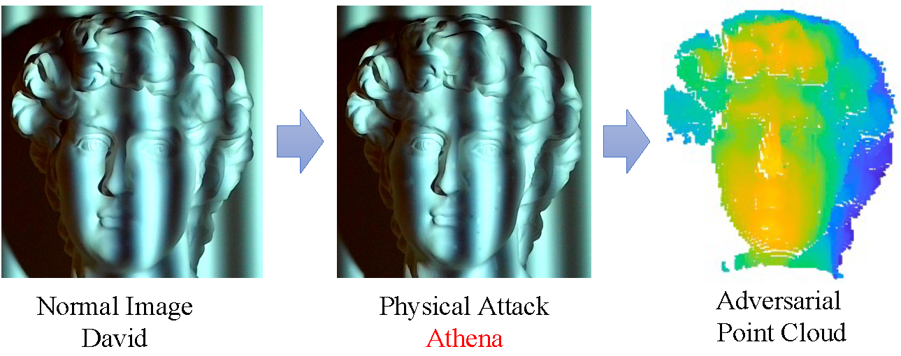

# CVPR2023: Physical-World Optical Adversarial Attacks on 3D Face Recognition
<a href="https://arxiv.org/abs/2205.13412"></a>
<a href="https://opensource.org/licenses/MIT"></a>  

<p align="center">

</p>

> 2D face recognition has been proven insecure for physical adversarial attacks. However, few studies have investigated the possibility of attacking real-world 3D face recognition systems. 3D-printed attacks recently proposed cannot generate adversarial points in the air. In this paper, we attack 3D face recognition systems through elaborate optical noises. We took structured light 3D scanners as our attack target. End-to-end attack algorithms are designed to generate adversarial illumination for 3D faces through the inherent or an additional projector to produce adversarial points at arbitrary positions. Nevertheless, face reflectance is a complex procedure because the skin is translucent. To involve this projection-and-capture procedure in optimization loops, we model it by Lambertian rendering model and use SfSNet to estimate the albedo. Moreover, to improve the resistance to distance and angle changes while maintaining the perturbation unnoticeable, a 3D transform invariant loss and two kinds of sensitivity maps are introduced. Experiments are conducted in both simulated and physical worlds. We successfully attacked point-cloud-based and depth-image-based 3D face recognition algorithms while needing fewer perturbations than previous state-of-the-art physical-world 3D adversarial attacks.. 


## Description   
Official Implementation of our StructuredLightAttack paper. We extend the C&W attack which includes the 3D structured light reconstruction process. We only include the attack code here without the 3D structured light rebuild code. For 3D structured light rebuild code, you can refer to https://github.com/phreax/structured_light.git. 

### Watch the demo video here (please set the video resolution as 1080p)
[](https://youtu.be/zwAXvlh70yQ)

## Table of Contents
- [CVPR2023: Physical-World Optical Adversarial Attacks on 3D Face Recognition](#cvpr2023-physical-world-optical-adversarial-attacks-on-3d-face-recognition)
  - [Description](#description)
  - [Table of Contents](#table-of-contents)
  - [Recent Updates](#recent-updates)
  - [Getting Started](#getting-started)
    - [Prerequisites](#prerequisites)
    - [Installation](#installation)
    - [Run the attack](#run-the-attack)
  - [Citation](#citation)
  
## Recent Updates
**`2023.3.10`**: Initial code release  


## Getting Started
### Prerequisites
- Linux
- NVIDIA GPU + CUDA CuDNN (CPU may be possible with some modifications, but is not inherently supported)
- Python 3.8+
- pytorch, numpy

### Installation
- Clone this repo:
``` 
git clone https://github.com/PolyLiYJ/SLAttack.git
cd SLAttack
```
- Dependencies:  
We recommend running this repository using [Anaconda](https://docs.anaconda.com/anaconda/install/). 
```
conda install --yes --file requirements.txt
```

### Run the untarget attack
- To excecute L2Loss attack on Bosphorus dataset and PointNet and save the adversarial point cloud.
- L2Loss is optimized on the **phase map**. Please see our paper.
```
python3 Test_CW_SL.py --dataset Bosphorus \
--model PointNet \
--dist_function L2Loss
```

- For comparison, you can also excecute L2Loss_pt attack on Bosphorus dataset and PointNet and save the adversarial point cloud.
- L2Loss_pt loss is optimized on the **point cloud**. 
```
python3 Test_CW_SL.py --dataset Bosphorus \
--model PointNet \
--dist_function L2Loss_pt
```

### Run the target attack
- To excecute L2 attack on Bosphorus dataset and PointNet and save the adversarial point cloud.
- L2 loss is optimized on the **phase map**. Please see our paper.
```
python3 Test_CW_SL.py --dataset Bosphorus \
--model PointNet \
--dist_function L2Loss \
--whether_target
```

- For comparison, you can also excecute L2Loss_pt on Bosphorus dataset and PointNet and save the adversarial point cloud.
- L2Loss_pt is optimized on the **point cloud**. 
```
python3 Test_CW_SL.py --dataset Bosphorus \
--model PointNet \
--dist_function L2Loss_pt \
--whether_target
```

### To reproduce the attack success rate in our paper
- Download the Bosphorus dataset at http://bosphorus.ee.boun.edu.tr/Home.aspx
- Convert the dataset to text files, see dataset/readbnt.py. We use the farthest sampling from PointNet code to downsample the faces to 4000 points.
- Run untarget attack by
```
python Evaluate.py --whether_1d --attack_lr 0.01 --num_iter 100 --early_break --binary_step 5 --dist_function L2Loss_pt
```
- Run the target attack by set the --whether_target parameter. It is suggested to set the device as cuda to accelerate the computation.
```
python Evaluate.py --whether_target --whether_1d --attack_lr 0.001 --num_iter 300 --binary_step 5 --dist_function L2Loss_pt
```
- To test ASR on different models, you can just change the args.model parameters. We have upload the pretrained PointNet, PointNet2, and DGCNN models to the cls/Bosphorus folder. For example, to test the untarget attack success rate on PointNet++Msg, you can use
```
python Evaluate.py --whether_1d --attack_lr 0.001 --num_iter 1000 --binary_step 10 --dist_function L2Loss_pt --model PointNet++Msg
```


### Get the structured light image

- To get fringe images (adversarial illumination) from the above generated adversarial point cloud. The clean point cloud and adversarial point cloud are needed.
```
python get_adv_illumination --normal_pc test_face_data/person1.txt --adv_pc test_face_data/adv_person1_untargeted_L1Loss_5.txt --outfolder test_face_data/person1/adversarial_fringe
```

## Citation
If you use this code for your research, please cite our paper <a href="https://arxiv.org/abs/2205.13412">Physical-World Optical Adversarial Attacks on 3D Face Recognition</a>:

```
@inproceedings{
yanjieli2023physicalworld,
title={Physical-World Optical Adversarial  Attacks on 3D Face Recognition},
author={Yanjie Li, Yiquan Li, Xuelong Dai, Songtao Guo, Bin Xiao},
booktitle={Conference on Computer Vision and Pattern Recognition 2023},
year={2023},
url={https://openreview.net/forum?id=vGZl0N9s0s}
}
```

